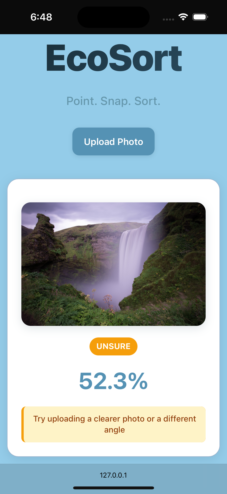

# EcoSort: AI-Powered Waste Classification

EcoSort is a web-based application that uses computer vision to classify waste materials and provide recycling guidance. Built with React and ONNX Runtime Web, it runs entirely in the browser without requiring server-side processing.

## Model Architecture

### Core Model: MobileNetV3-Small
The project uses **MobileNetV3-Small** as the backbone architecture, chosen for its optimal balance of accuracy and efficiency for mobile/web deployment:

- **Architecture**: MobileNetV3-Small with ImageNet pre-trained weights
- **Input Size**: 224×224 pixels (standard ImageNet resolution)
- **Output**: 6-class classification (glass, paper, cardboard, plastic, metal, trash)
- **Optimization**: ONNX format for cross-platform deployment
- **Inference**: Client-side using ONNX Runtime Web with WASM

### Classification Hierarchy
The model implements a two-level classification system:

```
Material Classification (6 classes)
├── Glass → Recycle
├── Paper → Recycle  
├── Cardboard → Recycle
├── Plastic → Recycle
├── Metal → Recycle
└── Trash → Landfill
```

### Training Configuration
- **Data Augmentation**: Color jittering, Gaussian blur, random transformations
- **Normalization**: ImageNet mean/std values (`[0.485, 0.456, 0.406]` / `[0.229, 0.224, 0.225]`)
- **Loss Function**: Cross-entropy loss
- **Optimizer**: Adam with learning rate scheduling
- **Validation Split**: 10% stratified split

## Data Construction

### Dataset Structure
The training dataset consists of **2,527 images** organized into 6 material categories:

```
data/raw/
├── glass/    
├── paper/      
├── cardboard/ 
├── plastic/   
├── metal/     
└── trash/     
```

### Data Processing Pipeline
1. **Manifest Creation**: `data/create_manifest.py` processes the raw dataset
   - Parses `zero-indexed-files.txt` with filename-label pairs
   - Maps material IDs to bin categories
   - Generates CSV manifest with paths and labels

2. **Stratified Splitting**: Ensures balanced representation across classes
   - Training: 90% of data
   - Validation: 10% of data
   - Test: Optional split for final evaluation

3. **Preprocessing**: Standard ImageNet normalization and augmentation
   - Resize to 224×224
   - Color jittering and blur for training
   - Tensor normalization


## Web Application

### Key Features
- **Dual Input Methods**: File upload + camera capture
- **Real-time Processing**: Instant classification results
- **Responsive Design**: Works on desktop and mobile

### Basic Usage
1. **Open the app** in your browser
2. **Upload a photo** or **take a picture** using your camera
3. **View results** with confidence percentage and bin recommendation
4. **Follow recycling tips** provided for each material type

### Example Classifications

#### High Confidence Example


**Scenario**: Clear plastic water bottle
- **Result**: RECYCLE · plastic (94.9%)

#### Low Confidence Example


**Scenario**: Unrelated Picture
- **Result**: UNSURE (52.3%)